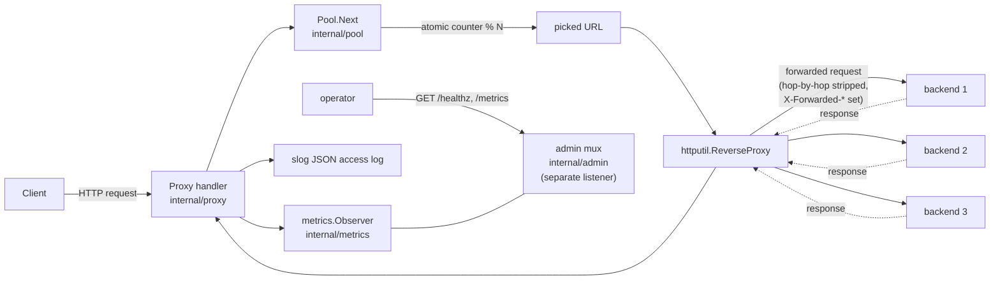

# loadbalancer

A blind round-robin HTTP load balancer built as a study in traffic distribution and failure isolation. **V1 is intentionally fragile**: it has no health awareness, no per-backend state, and no cross-backend retry. The point of V1 is to produce, then measure, the cascading-failure behaviour that V2 (EWMA scoring + circuit breaking + cross-backend retry) will fix.

## Architecture



A single `atomic.Uint64` counter modulo `len(backends)` selects the next backend (LB-02). Round-robin distribution is exact under ideal conditions: every backend receives `⌊total/N⌋ ± 1` requests over any window of ≥ 1000 requests (LB-03).

`/healthz` and `/metrics` live on a **separate admin listener** so observability cannot be starved by upstream issues on the data plane.

## Why this design

**Single shared atomic counter** — per-worker counters drift under uneven goroutine scheduling and complicate the LB-03 fairness guarantee. Atomic contention is irrelevant at V1's target scale (single host, < 10k RPS).

**`httputil.ReverseProxy`** — standard library, well-understood, already handles streaming bodies and connection pooling. Custom `Director` plugs in backend selection and header rewriting; custom `ErrorHandler` translates transport errors into 502/504. No need to reinvent the proxy core.

**Time-to-first-byte timeout (not total request)** — a total-request timeout drops legitimate streaming responses; TTFB cleanly distinguishes "backend is stuck" from "response is large." Configured via `Transport.ResponseHeaderTimeout`.

**Separate admin listener** — `/healthz` and `/metrics` are bound to a different port than the data plane. If the proxy is overloaded with stuck upstream connections, the operator can still scrape metrics and probe health.

## V1 weaknesses — locked in by `spec.md`

These are *not* bugs. Each is a `MUST NOT` requirement that V2 will replace.

| Failure | Spec ID | Test |
|---------|---------|------|
| No active health checks — dead backends keep getting traffic | LB-04 | `TestProxy_DeadBackendDoesNotCauseSkip` |
| No per-backend state — no latency or error tracking | LB-05 | (architectural) |
| Connection failures do not skip the failed backend | LB-06 | `TestProxy_DeadBackendDoesNotCauseSkip` |
| No retry — neither same-backend nor cross-backend | LB-14 | `TestProxy_DoesNotRetryOn5xx` |

Run the chaos demo below to see all four bite.

## V2 fixes (planned, not yet implemented)

| Step | Fix | Status |
|------|-----|--------|
| 1 | EWMA latency scoring + power-of-two random choices | not started |
| 2 | Exponential-backoff retry across *different* backends | not started |
| 3 | Per-backend circuit breaker (closed / open / half-open) | not started |

See `system-design-study-plan.md` Build 2.5 for the full V2 spec.

## Build

Requires Go 1.23+.

```bash
make build          # outputs bin/lbserver and bin/echobackend
```

## Run

**Single LB + one backend** (foreground LB; smoke test):

```bash
make run
```

**Three backends + one LB** (all backgrounded; mirrors `key-value-store/run-cluster`):

```bash
make run-cluster    # LB on :7080, backends on :9001, :9002, :9003
make stop-cluster
```

**Docker** (3 backends + 1 LB on a private network):

```bash
make run-docker     # LB published on :7080, admin on :7090
make stop-docker
```

**Custom flags:**

```bash
./bin/lbserver \
  --listen=:7080 \
  --admin-listen=:7090 \
  --backends=http://b1:9001,http://b2:9001,http://b3:9001 \
  --upstream-timeout=5s \
  --log-format=json
```

| Flag | Default | Description |
|------|---------|-------------|
| `--listen` | `:7080` | HTTP listen address for the proxy (data plane) |
| `--admin-listen` | `:7090` | HTTP listen address for `/healthz` and `/metrics` |
| `--backends` | *(required)* | Comma-separated backend URLs; empty fails startup |
| `--upstream-timeout` | `5s` | Time-to-first-byte timeout per upstream request |
| `--log-format` | `json` | `json` or `text` |

## Test

```bash
make test                                       # all packages with -race
go test -race -count=1 ./internal/pool/...      # round-robin fairness, concurrency
go test -race -count=1 ./internal/proxy/...     # forwarding semantics, 502/504, no-retry
go test -race -count=1 ./internal/admin/...     # /healthz, /metrics
```

## Chaos report

A purpose-built load-and-chaos runner (`cmd/chaos`) drives 60 s of vegeta
traffic against a self-spawned cluster while randomly killing and reviving
backends every 10 s. It writes a timestamped report directory containing the
raw vegeta results, a per-second time series, the chaos timeline, and a text
summary.

```bash
make chaos          # 60s @ 200 rps, kill/revive every 10s, tag=v1
make chaos-report   # cat the latest summary.txt + chaos.log
```

Output (one of `reports/v1-<UTC-timestamp>/`):

```
vegeta.bin       Raw vegeta result stream — `vegeta plot < vegeta.bin > plot.html`
timeseries.csv   ts_unix,ts_iso,total,success,success_rate,p50_ms,p99_ms (1s bins)
chaos.log        ISO-timestamp \t KILL|REVIVE \t backend-id
summary.txt      vegeta status codes, latency percentiles, success ratio
```

The V1 baseline is the *failure* photograph: success rate sags to roughly
`(N-dead)/N` while a backend is down, because the round-robin keeps sending
its share of requests to the dead one (LB-06). V2's chaos report (same flags,
`--tag=v2`) is the comparison: circuit breakers should hold success > 99 %
throughout. See `reports/README.md` for the format and comparison workflow.

## Usage

```bash
# After `make run-cluster`:

# 1. Round-robin distribution
for i in $(seq 1 9); do
  curl -s http://localhost:7080/anything | jq -r .backend
done
# → b1 b2 b3 b1 b2 b3 b1 b2 b3

# 2. Health & metrics (separate port)
curl -s http://localhost:7090/healthz
# → ok

curl -s http://localhost:7090/metrics | grep lb_requests_total
# → lb_requests_total{backend="http://localhost:9001",status="200"} 3
#   lb_requests_total{backend="http://localhost:9002",status="200"} 3
#   lb_requests_total{backend="http://localhost:9003",status="200"} 3

# 3. CHAOS — kill backend b2 and watch round-robin keep sending traffic to it.
# (Use pkill against the backend's --id, not lsof on the port: lsof returns
# both the listener and any established TCP peer, which would also kill the LB.)
pkill -f "id=b2"
for i in $(seq 1 9); do
  curl -s -o /dev/null -w "%{http_code} " http://localhost:7080/anything
done
echo
# → 200 502 200 200 502 200 200 502 200
#
# Every third request returns 502. The proxy makes no attempt to skip the dead
# backend. This is V1 working exactly as specified — and exactly what V2 will fix.
```

## Branch model

| Branch | Purpose |
|--------|---------|
| `main` | Stable — tests must pass before merging. Completed builds are tagged here. |
| `v<N>-<feature>` | Work branch for the next build, cut from `main` at the previous build's tag. |

| Tag | Description |
|-----|-------------|
| `v1.0.0` | V1 complete — blind round-robin, no health awareness, no retry |

## What I'd do next

- **Implement V2** per `spec.md` (EWMA scoring, P2C, cross-backend retry, circuit breakers).
- **Chaos test report** — run a 60-second load test (vegeta) while randomly killing/reviving backends every 10 s. Compare V1 vs V2 graphs of success rate and p99.
- **Sticky sessions via consistent hashing** for session-affinity workloads.
