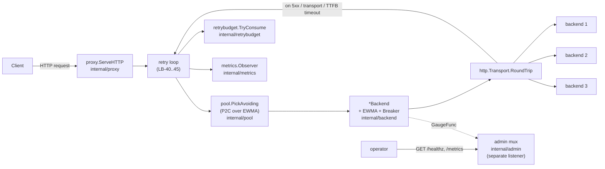

# loadbalancer

A health-aware HTTP load balancer built as a study in traffic distribution and failure isolation. **V2** picks backends by power-of-two-choices (P2C) over an EWMA latency score, skips backends whose circuit breaker is Open, retries idempotent failures across backends with exponential backoff, and caps retries via a per-second budget. **V1** is the deliberately-fragile baseline (blind round-robin, no health awareness, no retry) we measure V2 against.

The interesting artifact is the **V1→V2 comparison** — same chaos timeline (`--seed=42`), 60 s @ 200 rps, 6 backend kill/revive events:

| Metric | V1 baseline | V2 result |
|--------|-------------|-----------|
| Success ratio | **83.30 %** | **99.99 %** |
| 502 count (of 12 000 requests) | **2 004** | **1** |
| p50 latency | 1.33 ms | 1.12 ms |
| p99 latency | 5.70 ms | 5.80 ms |
| Per-second success rate during kill windows | ~0.665 (= 2/3) | **1.000** in every full second |

V2 absorbed every failure with no measurable latency cost. The retry path fired 13 times in the run; the breaker held in reserve as a backup for sustained failure (which never lasted long enough to trip given how effective retry was).

## Architecture



Each *Backend* owns its EWMA score and its circuit breaker. The pool partitions backends into Closed (eligible for P2C) and Half-open (selected only when no Closed backend is left). Open backends are excluded entirely. The proxy's retry loop picks a fresh backend on each attempt (avoiding the just-failed one) and stops when the request succeeds, the method is not idempotent, the budget is exhausted, or the max-retries cap is hit.

`/healthz` and `/metrics` live on a **separate admin listener** so observability cannot be starved by upstream issues on the data plane. The `lb_breaker_state`, `lb_ewma_score_seconds`, and `lb_eligible_backends` gauges are `GaugeFunc`s that read live state on each scrape — no publish-on-change required.

## Why these choices

**Power-of-two random choices** — pure random would let a slow backend keep its share of traffic; pure least-EWMA would all dogpile the single fastest backend. P2C is the proven middle: O(1), no global state contention, provably outperforms uniform random for skewed-latency pools (Mitzenmacher 2001).

**Passive breaker, not active health checks** — Envoy's "outlier detection" is purely passive for a reason: in-band errors are the freshest signal. Active probes add traffic without telling us anything we can't learn from real requests.

**Cross-backend retry on idempotent methods only** — POST and PATCH retry is unsafe in general (the request may have side effects on the backend before the failure was visible to us). RFC 7231 §4.2.2 method semantics. `Idempotency-Key` header support could lift this restriction in a future build.

**Retry budget = 10 % per second** — the cap that prevents retry storms. When the entire upstream fleet is degraded, retries stop adding load instead of doubling down on it. Industry standard (Envoy, Istio, gRPC default).

**Drop `httputil.ReverseProxy`** — V1 used it, V2 doesn't. ReverseProxy is built around fire-and-forget; V2 needs to inspect the upstream response status before deciding whether to forward or retry. We issue the upstream call ourselves with `http.Transport.RoundTrip`, capture the response, then decide.

**Response buffering trade-off** — V2 buffers each upstream response into memory (capped at 1 MiB) so it can discard a 5xx and try elsewhere. The spec's "no buffering beyond defaults" out-of-scope item is in tension with the cross-backend retry requirement; we resolve by capping at 1 MiB. Above the cap, the response cannot be retried — it streams through verbatim. Documented as a CALLOUT in `internal/proxy/proxy.go`.

## V1 → V2 deltas (spec §1)

| V1 failure | V2 fix |
|------------|--------|
| No health awareness — dead backends keep getting traffic (LB-04) | Per-backend circuit breaker; Open backends excluded from selection |
| No per-backend state — no latency tracking (LB-05) | Per-backend EWMA latency score, sliding-window error counts |
| Connection failures don't skip the failed backend (LB-06) | P2C selects from the closed-circuit set only |
| No retry — neither same-backend nor cross-backend (LB-14) | Cross-backend retry on idempotent methods, exp backoff + jitter, retry budget |

## Build

Requires Go 1.23+.

```bash
make build          # outputs bin/lbserver, bin/echobackend, bin/chaos
```

## Run

**Three backends + one LB** (all backgrounded):

```bash
make run-cluster    # LB on :7080, backends on :9001, :9002, :9003
make stop-cluster
```

**Docker** (3 backends + 1 LB on a private network):

```bash
make run-docker     # LB published on :7080, admin on :7090
make stop-docker
```

**Custom flags** — V1 flags preserved; V2 adds eight tuning knobs:

```bash
./bin/lbserver \
  --listen=:7080 \
  --admin-listen=:7090 \
  --backends=http://b1:9001,http://b2:9001,http://b3:9001 \
  --upstream-timeout=5s \
  --ewma-alpha=0.1 \
  --breaker-window=10 \
  --breaker-error-threshold=0.5 \
  --breaker-reset-timeout=10s \
  --breaker-reset-cap=60s \
  --max-retries=2 \
  --retry-base=10ms \
  --retry-cap=200ms \
  --retry-budget=0.10
```

| Flag | Default | Description |
|------|---------|-------------|
| `--listen` | `:7080` | Proxy listener |
| `--admin-listen` | `:7090` | `/healthz` + `/metrics` listener |
| `--backends` | *(required)* | Comma-separated backend URLs |
| `--upstream-timeout` | `5s` | TTFB timeout per attempt |
| `--ewma-alpha` | `0.1` | EWMA smoothing factor |
| `--breaker-window` | `10` | Sliding-window size for breaker error rate |
| `--breaker-error-threshold` | `0.5` | Error ratio that trips Closed → Open |
| `--breaker-reset-timeout` | `10s` | Initial Open → Half-open delay |
| `--breaker-reset-cap` | `60s` | Maximum Open → Half-open delay (doubling) |
| `--max-retries` | `2` | Additional attempts after the first failure |
| `--retry-base` | `10ms` | Base backoff before retry attempt 1 |
| `--retry-cap` | `200ms` | Cap on per-attempt backoff |
| `--retry-budget` | `0.10` | Fraction of total requests that may retry |
| `--drain-timeout` | `30s` | Max wait for in-flight requests on SIGTERM (v2.1) |

## Test

```bash
make test                                       # all packages with -race
go test -race -count=1 ./internal/pool/...      # P2C selection, eligibility, fallback
go test -race -count=1 ./internal/proxy/...     # forwarding, retry, breaker integration
go test -race -count=1 ./internal/breaker/...   # state machine
go test -race -count=1 ./internal/ewma/...      # smoothing + decay
go test -race -count=1 ./internal/retrybudget/... # 1-second sliding window
```

## Chaos report

The chaos runner (`cmd/chaos`) drives 60 s of vegeta load against a self-spawned cluster while randomly killing and reviving backends every 10 s, then writes a timestamped report. Both V1 and V2 use the same runner with the same seed for like-for-like comparison.

```bash
make chaos          # V1 baseline: ./bin/chaos --tag=v1 --seed=42
make chaos-v2       # V2 acceptance: ./bin/chaos --tag=v2 --seed=42
make chaos-report   # cat the latest summary.txt + chaos.log
```

Each `reports/<tag>-<UTC>/` directory contains:

```
vegeta.bin       Raw vegeta result stream — `vegeta plot < vegeta.bin > plot.html`
timeseries.csv   ts_unix,ts_iso,total,success,success_rate,p50_ms,p99_ms (1s bins)
chaos.log        ISO-timestamp \t KILL|REVIVE \t backend-id
summary.txt      vegeta status codes, latency percentiles, success ratio
seed.txt         RNG seed (V2 chaos runner only) — for reproducibility
```

Two committed baselines anchor spec §8 Acceptance:

- [`reports/v1-20260423T222339Z/`](reports/v1-20260423T222339Z/) — V1 baseline at seed=42
- [`reports/v2-20260423T222759Z/`](reports/v2-20260423T222759Z/) — V2 acceptance at seed=42 (same chaos timeline)

## Manual chaos demo (V1 vs V2 side by side)

```bash
make run-cluster
# In another terminal:
for i in $(seq 1 9); do curl -s -o /dev/null -w "%{http_code} " http://localhost:7080/anything; done
# All 200s.

# Kill b2 — see what V2 does:
pkill -f "id=b2"
# (Use pkill against the backend's --id, not lsof on the port: lsof returns
#  both the listener and any established TCP peer, which would also kill the LB.)
for i in $(seq 1 9); do curl -s -o /dev/null -w "%{http_code} " http://localhost:7080/anything; done
# All 200s in V2; in V1 every third would be 502.
```

## Branch model

| Branch | Purpose |
|--------|---------|
| `main` | Stable — tests must pass before merging. Completed builds are tagged here. |
| `v<N>-<feature>` | Work branch for the next build, cut from `main` at the previous build's tag. |

| Tag | Description |
|-----|-------------|
| `v1.0.0` | V1 complete — blind round-robin, no health awareness, no retry; baseline chaos report (seed=42) included |
| `v2.0.0` | V2 complete — P2C + EWMA + per-backend circuit breakers + cross-backend retry with budget; acceptance chaos report (seed=42) included |
| `v2.1.0` | Graceful drain on SIGTERM (`--drain-timeout`); `/healthz` returns 503 "draining" so external LBs can fail traffic away cleanly |

## What I'd do next

- **Active health checks** as a *complement* to the breaker, for backends that go quiet but aren't dead (very low traffic, no in-band signal).
- **`Idempotency-Key` header support** to extend retry to POST/PATCH safely.
- **Sticky sessions via consistent hashing** for session-affinity workloads.
- **TLS termination at the proxy** and mTLS to backends.
- **HTTP/2, gRPC, and WebSocket upgrades** (the WebSocket+retry interaction is the interesting design problem).
- **Multi-instance HA** — stateless N copies behind an LB-of-LBs, with per-instance retry budget cap.
